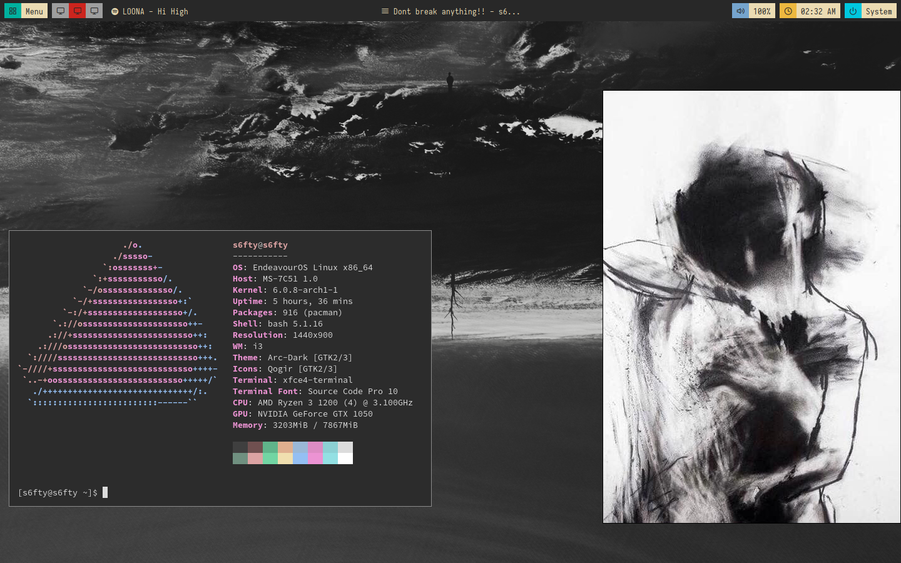
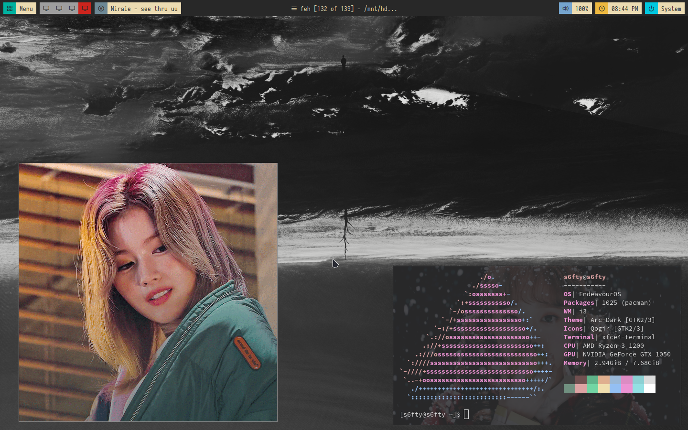

# Borders-Comfy

**customized menu parts for my like from [adi1090x's block theme](https://github.com/adi1090x/polybar-themes "adi1090x's block theme") added _[player mpris tail]_(https://github.com/polybar/polybar-scripts/tree/master/polybar-scripts/player-mpris-tail "player mpris tail") for spotify module**

# Borders-Co(mpd)fy

## **uses default mpd config but edited colours**
